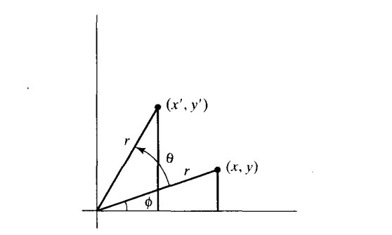

# 二维向量

> Vec2 类型 **类**

## 初始化一个二维零向量

```js
const vec2 = new Vec2()
```

## 私有属性

| 属性名 | 描述 | 类型 |
| - | - | - |
| _value | 存放二维向量各个分量的数据 | [ARRAY_TYPE](./common.md/#ARRAY_TYPE) |

## 静态方法

### fromValues

```js
/**
 * 使用2个值创建一个二维向量
 * 
 * @param {Number} x 
 * @param {Number} y 
 * @returns {Vec2}
 */
```

### ceil

```js
/**
 * 将二维向量的各个分量向上取整
 * 
 * @param {Vec2} vec2 
 * @returns {Vec2}
 */
```

### floor

```js
/**
 * 将二维向量的各个分量向下取整
 * 
 * @param {Vec2} vec2 
 * @returns {Vec2}
 */
```

### round

```js
/**
 * 将二维向量的各个分量四舍五入取整
 * 
 * @param {Vec2} vec2 
 * @returns {Vec2}
 */
```

### linerInterpolation

```js
/**
 * 在两个二维向量中线性插值获得一个二维向量
 * 
 * @param {vec2} vec2_1
 * @param {vec2} vec2_2
 * @param {Number} t 
 * @returns {Vec2}
 */
```

## 实例方法

### get

```js
/**
 * 获取二维向量的某个分量的值
 * 
 * @param {string} component 有效值x|y 
 * @returns {Number}
 */
```

### clone

```js
/**
 * 克隆一个二维向量
 * 
 * @returns {Vec2}
 */
```

### copy

```js
/**
 * 复制另一个二维向量的值
 * 
 * @param {Vec2} vec2
 * @returns {Vec2}
 */
```

### add

```js
/**
 * 两个二维向量的各个分量相加
 * 
 * @param {Vec2} vec2
 * @returns {Vec2}
 */
```

### subtract

```js
/**
 * 两个二维向量的各个分量相减
 * 
 * @param {Vec2} vec2
 * @returns {Vec2}
 */
```

### multiply

```js
/**
 * 两个二维向量的各个分量相乘
 * 
 * @param {Vec2} vec2
 * @returns {Vec2}
 */
```

### divide

```js
/**
 * 两个二维向量的各个分量相除
 * 
 * @param {Vec2} vec2
 * @returns {Vec2}
 */
```

### scale

```js
/**
 * 缩放一个二维向量
 * 
 * @param {Number} ratio
 * @returns {Vec2}
 */
```

### distance

```js
/**
 * 返回两个二维向量的欧几米德距离
 * 
 * @returns {Vec2}
 */
```

### squaredDistance

```js
/**
 * 返回两个二维向量的欧几米德距离的平方
 * 
 * @returns {Vec2}
 */
```

### length

```js
/**
 * 返回二维向量到坐标原点的欧几米德距离
 * 
 * @returns {Vec2}
 */
```

### squaredLength

```js
/**
 * 返回二维向量到坐标原点的欧几米德距离的平分
 * 
 * @returns {Vec2}
 */
```

### negate

```js
/**
 * 负向量
 * 
 * @returns {Vec2}
 */
```

### inverse

```js
/**
 * 各个向量去倒数
 * 
 * @returns {Vec2}
 */
```

### normalize

```js
/**
 * 归一化向量,也就是二维向量的长度为1
 * 
 * @returns {Vec2}
 */
```

### dot

> 两个二维向量的点积返回一个数值
> 大小为$|\vec a| \times |\vec b| \times \cos\theta $转为坐标计算为$x_1 * y_1 + x_2 * y_2$

```js
/**
 * 计算两个向量的点积
 * 
 * @param {Vec2} vec2 
 * @returns {Number}
 */
```

### cross

> 两个二维向量的叉积返回一个三维向量，方向为与两个二维向量组成的平面垂直，大小为$|\vec a| \times |\vec b| \times \sin\theta $转为坐标计算为$x_1 * y_2 + x_2 * y_1$

```js
/**
 * 计算两个向量的叉积
 * 
 * @param {Vec2} vec2 
 * @returns {Vec3}
 */
```

### rotate

```js
/**
 * 向二维向量b为坐标原点将向量偏移一个角度
 * 
 * @param {Vec2} vec2 
 * @param {Number} rad
 * @returns {Vec2}
 */
```

我们首先确定当基准点为坐标原点时位置P进行旋转的变换方程，如下图所示



$$
\begin{cases}
x' = r\cos( \phi + \theta) = r\cos \phi \cos \theta - r\sin\phi\sin\theta \\
y' = r\sin( \phi + \theta) = r\cos \phi \sin \theta + r\sin\phi\cos\theta \\
\end{cases}
\tag{1}
$$

$$
\begin{cases}
x = r\cos\phi \\
y = r\sin\phi
\end{cases}
\tag{2}
$$
将2式带入1式中得到
$$
\begin{cases}
x' =x\cos\theta - y\sin\theta \\
y' =x\sin\theta + y\cos\theta
\end{cases}
\tag{1}
$$

旋转矩阵使用矩阵形式表示为

$$
\begin{bmatrix}
\cos\theta & -\sin\theta \\
\sin\theta & \cos\theta
\end{bmatrix}
$$

旋转是一种移动对象而不改变其形状的刚体变换

### angle

```js
/**
 * 获取两个向量之间的夹角
 * 
 * @param {Vec2} vec2 
 * @returns {Number}
 */
```

> 两向量的夹角的余弦为两向量的点积和两向量的模长积的比值

$$
\cos \theta = \frac{\vec a \cdot \vec b}{|\vec a||\vec b|}
$$

> 注意: 在实现时由于模长的计算需要去平方根为了减少精度值丢失，先用两个模长的模长的平方乘积在取平分根

### exactEquals

```js
/**
 * 判断2个二维向量是否严格相对
 * 
 * @param {Vec2} vec2 
 * @returns {vec2}
 */
```

### equals

```js
/**
 * 判断2个二维向量是否相对相等，具体实现参考公共部分的equals方法
 * 
 * @param {Vec2} vec2 
 * @returns {vec2}
 */
```

### toString

```js
/**
 * 返回vec2的字符串描述
 * 
 * @returns {string}
 */
```